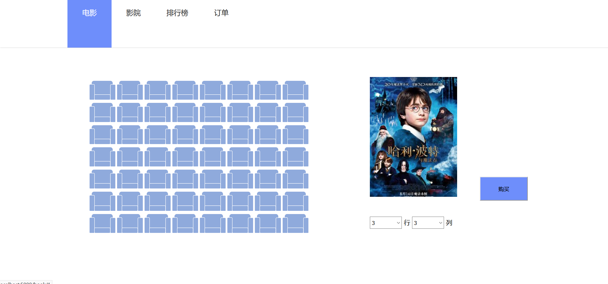

# film-ticket-booking-platform
# 电影订票助手

## 一、爬取数据

依赖包：requests, re, parsel

二.数据库建立

工具：Docker,Navicat

## 三、前端

HTML,CSS

python框架：Flask

## 四、数据库设计

ER图

表1 用户User

| **属性名**   | **数据类型** | **取值说明** | **约束说明** | **备注**               |
| ------------ | ------------ | ------------ | ------------ | ---------------------- |
| **userno**   | INT          |              | PRIMARY KEY  |                        |
| **userid**   | VARCHAR      | 20           | NOT NULL     |                        |
| **password** | VARCHAR      | 11           | NOT NULL     | 输入密码位于（3-11位） |
| **usertel**  | VARCHAR      | 20           |              |                        |

表2 用户订票信息Bookmessage

| **属性名**   | **数据类型** | **取值说明** | **约束说明** | **备注**                                   |
| ------------ | ------------ | ------------ | ------------ | ------------------------------------------ |
| **userno**   | INT          |              | NOT NULL     | 一个用户可以建立多条购买记录，不能作为主码 |
| **bkcinema** | INT          |              | UNIQUE       | 将三者级联作为唯一的码                     |
| **bkfilm**   | INT          |              | UNIQUE       |                                            |
| **bktime**   | VARCHAR      |              | UNIQUE       |                                            |

表3 电影Film

| **属性名**  | **数据类型** | **取值说明**   | **约束说明** | **备注**      |
| ----------- | ------------ | -------------- | ------------ | ------------- |
| **fno**     | INT          |                | PRIMARY KEY  | 建立BTREE索引 |
| **fname**   | VARCHAR      | 20             | NOT NULL     |               |
| **frate**   | DECIMAL      | 长度3，小数位1 | NOT NULL     |               |
| **fspan**   | VARCHAR      | 10             |              |               |
| **ftype**   | DECIMAL      | 20             |              |               |
| **leading** | VARCHAR      | 20             |              |               |
| **lv**      | VARCHAR      | 10             |              |               |
| **floc**    | VARCHAR      | 8              |              |               |
| **fyear**   | INT          |                |              |               |
| **url**     | VARCHAR      | 120            |              | 图片链接      |
| **intro**   | VARCHAR      | 400            |              |               |

表4 电影院Cinema

| **属性名** | **数据类型** | **取值说明**   | **约束说明** | **备注** |
| ---------- | ------------ | -------------- | ------------ | -------- |
| **cno**    | INT          |                | PRIMARY KEY  |          |
| **cname**  | VARCHAR      | 30             | NOT NULL     |          |
| **clo**    | VARCHAR      | 60             |              |          |
| **lprice** | DECIMAL      | 长度4，小数位1 |              |          |

表5 电影排片Filmschdule

| **属性名**    | **数据类型** | **取值说明**   | **约束说明** | **备注**                  |
| ------------- | ------------ | -------------- | ------------ | ------------------------- |
| **sno**       | INT          |                | PRIMARY KEY  |                           |
| **cno**       | INT          |                | NOT NULL     | 作为表Cinema属性cno的外码 |
| **fno**       | INT          |                | NOT NULL     | 作为表Film属性fno的外码   |
| **starttime** | VARCHAR      | 10             |              |                           |
| **scroom**    | VARCHAR      | 30             |              |                           |
| **fprice**    | DECIMAL      | 长度4，小数位1 |              |                           |

表6 电影票房Boffice

| **属性名**    | **数据类型** | **取值说明**   | **约束说明** | **备注**        |
| ------------- | ------------ | -------------- | ------------ | --------------- |
| **fno**       | INT          |                | PRIMARY KEY  | 表Film中fno外码 |
| **fname**     | VARCHAR      | 20             | NOT NULL     |                 |
| **avgoff**    | DECIMAL      | 长度6，小数位2 |              |                 |
| **peroff**    | DECIMAL      | 长度6，小数位4 |              |                 |
| **layout**    | INT          |                |              |                 |
| **perlayout** | DECIMAL      | 长度6，小数位4 |              |                 |
| **avgseat**   | INT          |                |              |                 |
| **perseat**   | DECIMAL      | 长度6，小数位4 |              |                 |

表7 排行榜top100

| **属性名**  | **数据类型** | **取值说明**   | **约束说明** | **备注** |
| ----------- | ------------ | -------------- | ------------ | -------- |
| **index**   | INT          |                | PRIMARY KEY  |          |
| **name**    | VARCHAR      | 30             | NOT NULL     |          |
| **leading** | VARCHAR      | 50             |              |          |
| **time**    | VARCHAR      | 50             |              |          |
| **rate**    | DECIMAL      | 长度3，小数位1 |              |          |
| **url**     | VARHCAR      | 120            |              | 图片链接 |

## 五、效果展示

